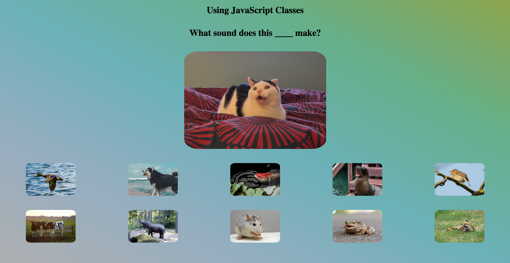

<h1>
  <span class="headline">Playing Audio in the Browser</span>
  <span class="subhead">Setup</span>
</h1>

## Setup

Fork this repository.

Clone your newly created repo into your `~/code/ga/labs` directory with the `git clone` command:

```bash
git clone https://github.com/<your-username>/u1-playing-audio-in-the-browser-starter-code.git
```

> 📚 Note: In the link above, where it says `<your-username>`, you should see the username from your GitHub account.

Next, `cd` into your new cloned directory, `u1-playing-audio-in-the-browser-starter-code`:

```bash
cd u1-playing-audio-in-the-browser-starter-code
```

Open the project's folder in your code editor:

```bash
code .
```

Open your `index.html` file in the browser. You should see something like this:

