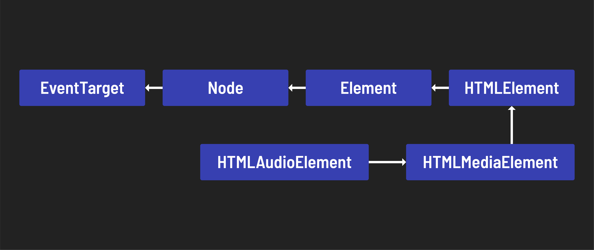

<h1>
  <span class="headline">Playing Audio in the Browser</span>
  <span class="subhead">The Audio Class</span>
</h1>

**Learning objective:** By the end of this lesson, students will be able to make use of a built-in JavaScript class and successfully add audio to an application.

## Built-In Audio Class

In this lesson, we'll be using the [built-in JavaScript Audio class in conjunction with an HTMLAudioElement](https://developer.mozilla.org/en-US/docs/Web/API/HTMLAudioElement/Audio) to be able to play sounds when a user interacts with the browser.

## The `HTMLAudioElement` API

Playing audio in the browser is straightforward, thanks to:

1. HTML5’s `<audio>` element, which can be added to any webpage (multiple instances if need be).
2. The *HTMLAudioElement* DOM interface that can be used to create an audio element in code using JS.

## The `Audio` Class

The `Audio` class allows us to create new instances (objects) that will play the intended sounds when a user interacts with our app. We just need to tell the `Audio` class what should be *assigned* to the new instance, which we will do by passing in an argument.

Let's start with the cat. The first thing we'll do is set up a cached element reference for the cat image:

```js
const catImg = document.querySelector('#cat')
```

To test out our cached element, we'll attach an event listener to the reference we just set up (`catImg`) and `console.log()` the event `target` when the image is clicked:

```js
catImg.addEventListener("click", (evt) => {
  console.log(evt.target)
})
```

In order to set up a new `HTMLAudioElement`, all we need to do is initialize a variable using the `new` keyword and the **built-in JavaScript `Audio` class**, with the following syntax:

```js
const catSays = new Audio('./assets/audio/cat.mp3')
```

Once we've done that, `catSays` is a new instance of the `Audio` class, which has all of the built-in values and methods of the Audio class available. We can play the audio file by invoking the `play()` method!  **Don't forget to adjust the volume so you don't melt your user's ears:**

```js
catImg.addEventListener("click", (evt) => {
  catSays.volume = .05
  catSays.play()
})
```

Try clicking on the cat image now!

The DOM element being created is an instance of [**HTMLAudioElement**](https://developer.mozilla.org/en-US/docs/Web/API/HTMLAudioElement).

However, it inherits its useful properties & methods from the [**HTMLMediaElement**](https://developer.mozilla.org/en-US/docs/Web/API/HTMLMediaElement) class.



The object hierarchy of the `HTMLAudioElement` provides a great example of the power of inheritance in Object Oriented Programming.

## 🎓 You Do

Now that the cat makes sounds, we need to get the other animals doing the same. That will be up to you.

Here is some commented pseudocode of the steps we used to get the cat meowing. You can reference this here, or even paste it into your own code to help you out:

```js
// Add event listener to <element>
// Listen for click on cached <element> and on a click:
  // make sure an image has been selected
    // Get the element id and use it to create an Audio instance/element!
    // Fix its volume
    // Play the audio element!
```

Good luck and have fun!